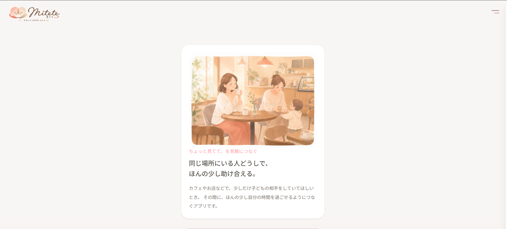
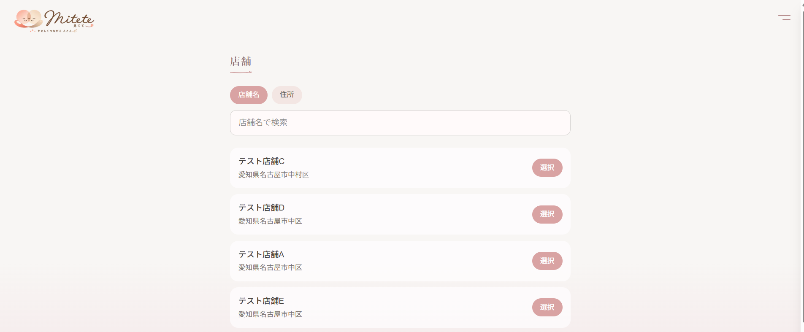
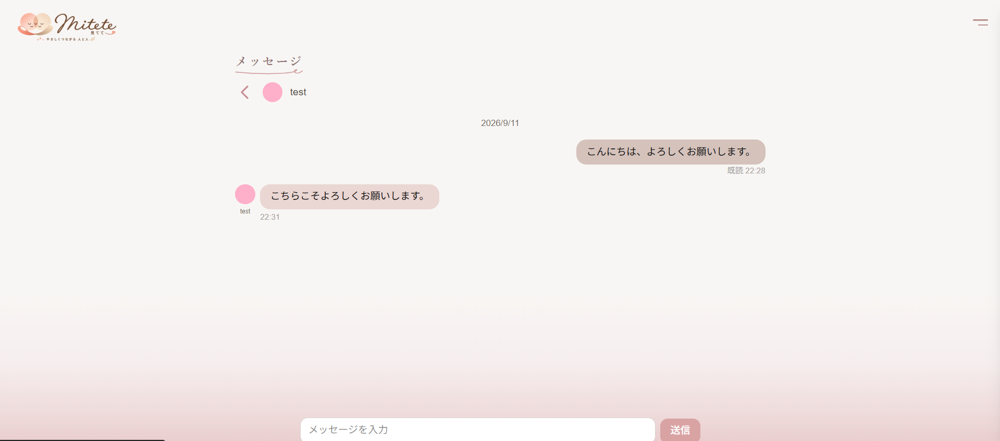

# 見てて

## アプリ概要

「ちょっと見てて、を気軽につなぐ」

カフェやお店などで、少しだけ子どもの相手をしていてほしいときに、
同じ場所にいる人どうしで、ほんの少し助け合えるようにつなぐアプリです。

## 画面イメージ

## デモ

公開URL：https://support-match-app.vercel.app

### テストアカウント

メールアドレス：demo@mitete.test
パスワード：MiteteDemo2026!

## 主な機能

- ユーザー登録・ログイン
- プロフィール設定
- 店舗の検索・選択
- サポート依頼
- 同じ場所にいる人とのマッチング
- マッチング相手とのメッセージ
- マッチングの終了・キャンセル
- 新着メッセージやマッチング状況の通知表示

## 使用技術

- Next.js 16.3.1
- React 19.2.8
- TypeScript
- Tailwind CSS 4
- Supabase
- Prisma 7.9.1
- PostgreSQL
- Vercel

## ローカルでの実行方法

```bash
git clone https://github.com/ayaka-tsu/support-match-app.git
cd support-match-app
npm install
```

プロジェクト直下に `.env.local` を作成し、Supabase接続用の以下の項目を設定します。

```env
NEXT_PUBLIC_SUPABASE_URL=
NEXT_PUBLIC_SUPABASE_PUBLISHABLE_KEY=
```

設定後、以下を実行します。

```bash
npm run dev
```

ブラウザで `http://localhost:3000` を開きます。

## 画面イメージ

### トップ画面



### 店舗一覧



### メッセージ画面


